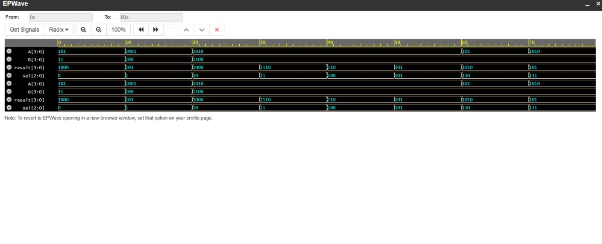

# 4-Bit Arithmetic Logic Unit (ALU) using Verilog HDL

## Project Overview

This project implements a **4-Bit Arithmetic Logic Unit (ALU)** using **Verilog HDL**. The ALU accepts two 4-bit inputs (`A` and `B`) and performs arithmetic, logical, and shift operations based on a 3-bit select signal (`sel`). The design was functionally verified using a Verilog testbench and simulated using **EDA Playground**.

---

## Operations Supported

| Select (`sel`) | Operation |
|:--------------:|-----------|
| `000` | Addition |
| `001` | Subtraction |
| `010` | Bitwise AND |
| `011` | Bitwise OR |
| `100` | Bitwise XOR |
| `101` | Bitwise NOT |
| `110` | Left Shift |
| `111` | Right Shift |

---

## Project Files

- `design.sv` – Verilog implementation of the 4-Bit ALU.
- `testbench.sv` – Testbench used for functional verification.
- `4bit_alu_waveform.jpeg` – Simulation waveform generated during verification.

---

## Tools Used

- Verilog HDL
- EDA Playground
- EPWave
- Visual Studio Code

---

## Simulation

The ALU was verified by applying different input combinations through the testbench. All supported operations produced the expected outputs, and the simulation results were confirmed using the generated waveform.

---

## Waveform

The simulation waveform is shown below.

